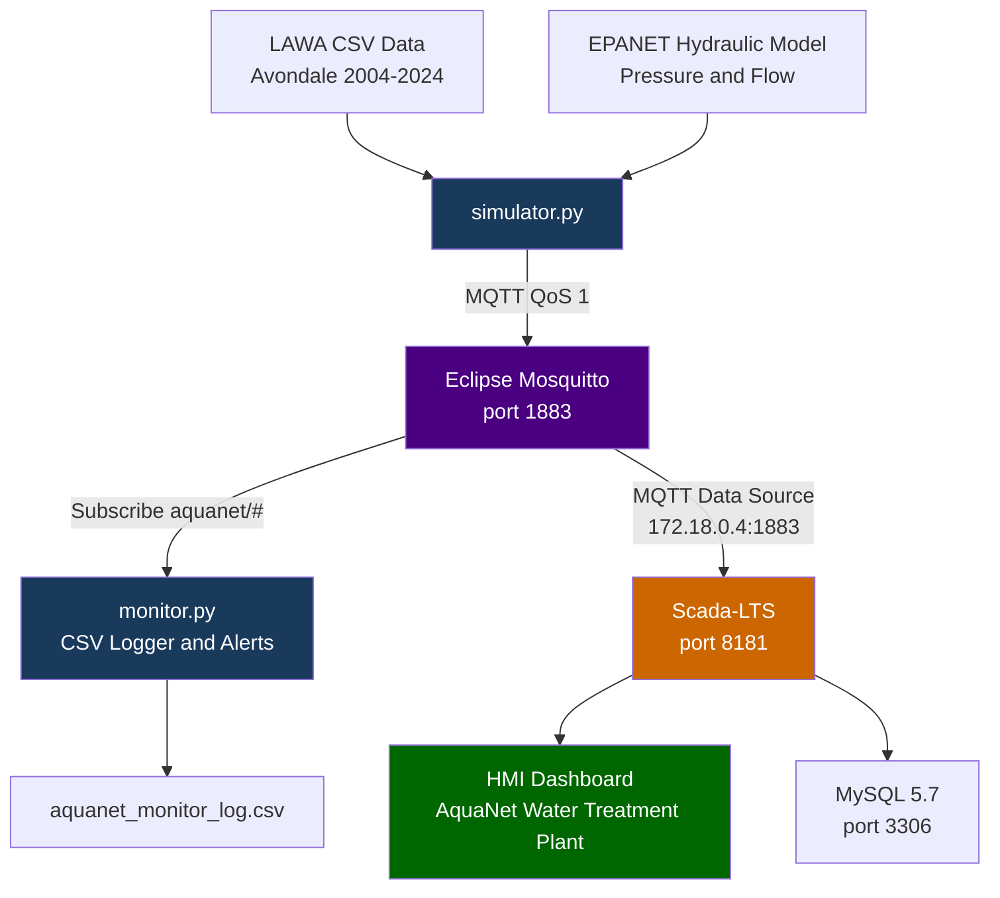

# SCADA System simulation with IoT 
> A simulated Industrial Control System (ICS) and SCADA environment modelling a fictional water treatment facility serving the Avondale catchment, Auckland, Aotearoa New Zealand.


---

## 📋 Overview

This lab was built as a portfolio project to demonstrate practical knowledge of:

- Industrial IoT sensor simulation using real New Zealand environmental data
- SCADA system configuration and live HMI dashboard monitoring
- MQTT protocol implementation with a local Eclipse Mosquitto broker
- Docker-based infrastructure orchestration
- Water quality threshold alerting based on NZ government standards (NPS-FM 2020)
- Critical infrastructure cybersecurity awareness

The project is inspired by real-world cyberattacks on water treatment facilities, including the 2021 Oldsmar, Florida incident where an attacker attempted to poison the water supply via an unsecured SCADA system, and the 2024 American Water attack affecting 14 million customers. It demonstrates how open-source tools can be used to simulate, monitor and secure critical water infrastructure.

---

## 🗺️ Scenario

**Fictional facility:** AquaNet NZ  
**Location:** Avondale catchment, Auckland, New Zealand  
**Purpose:** Municipal water treatment and distribution for the Avondale community  

The facility monitors six sensor streams in real time:

| Sensor | Unit | Source |
|--------|------|--------|
| Turbidity | NTU | LAWA real data |
| E.coli | CFU/100ml | LAWA real data |
| pH | pH units | LAWA real data |
| Nitrate | mg/L | LAWA real data |
| Pipe Pressure | bar | EPANET hydraulic model |
| Flow Rate | L/min | EPANET hydraulic model |

---

## 🏗️ Architecture



### MQTT Topic Structure

```
aquanet/
├── water/
│   ├── turbidity       # NTU
│   ├── ecoli           # CFU/100ml
│   ├── ph              # pH units
│   └── nitrate         # mg/L
├── hydraulic/
│   ├── pressure        # bar
│   └── flowrate        # L/min
└── alerts              # NPS-FM 2020 threshold breach messages
```

---

## 🛠️ Tool Stack


---

## 📊 Data Sources

### Water Quality — LAWA (Land, Air, Water Aotearoa)

Real historical monitoring data from Auckland Council for the Avondale stream catchment, covering 2004-2024.

- **Provider:** Auckland Council via LAWA
- **License:** Creative Commons Attribution 4.0 (CC BY 4.0)
- **Source:** [lawa.org.nz](https://www.lawa.org.nz)
- **Indicators:** Turbidity, E.coli, pH, Nitrate nitrogen
- **Site:** Avondale @ Shadbolt

The LAWA dataset contains real contamination events — E.coli spikes and turbidity events from storm runoff — which trigger genuine alerts without any artificial injection. This reflects actual water quality challenges faced by urban streams in Auckland.

### Hydraulic Data — EPANET Model

Pipe pressure and flow rate are generated using statistically realistic ranges derived from EPANET hydraulic simulation outputs for a small NZ residential distribution network.

- **Reference:** EPyT — EPANET Python Toolkit
- **Source:** [github.com/OpenWaterAnalytics/EPyT](https://github.com/OpenWaterAnalytics/EPyT)
- **Planned v2.0:** Full EPyT integration using an Avondale `.inp` pipe network file

---

## 🚨 Alert Thresholds

All thresholds are based on New Zealand's National Policy Statement for Freshwater Management 2020 (NPS-FM 2020) and AquaNet operational limits:

| Parameter | Threshold | Standard | Risk |
|-----------|-----------|----------|------|
| E.coli | > 540 CFU/100ml | NPS-FM 2020 | Recreational water unsafe |
| Turbidity | > 5.0 NTU | NPS-FM 2020 | Treatment required |
| pH | < 6.5 or > 8.5 | WHO / NPS-FM | Corrosion / scaling risk |
| Nitrate | > 6.9 mg/L | NPS-FM 2020 bottom line | Ecosystem health |
| Pressure | > 5.0 bar | AquaNet operational | Pipe burst risk |
| Pressure | < 1.5 bar | AquaNet operational | Backflow contamination |
| Flow Rate | > 150 L/min | AquaNet operational | Above normal range |

---

## 📁 Project Structure

```
scada-iot-lab/
├── README.md
├── LICENSE
├── .gitignore
├── requirements.txt
├── docker-compose.yml
├── mosquitto/
│   └── config/
│       └── mosquitto.conf
├── simulator/
│   └── simulator.py
├── monitor/
│   └── monitor.py
├── epanet/
│   └── lawa_avondale.csv
└── docs/
    ├── aquanet_monitor_log.csv
    └── screenshots/
```

---

## 🚀 Getting Started

### Prerequisites

- Ubuntu 22.04+ or similar Linux distribution
- Docker and Docker Compose
- Python 3.10+

### 1. Clone the repository

```bash
git clone https://github.com/Ofendor/scada-iot-lab.git
cd scada-iot-lab
```

### 2. Create Python virtual environment

```bash
python3 -m venv venv
source venv/bin/activate
pip install -r requirements.txt
```

### 3. Create Mosquitto password file

```bash
mkdir -p mosquitto/config
sudo docker run --rm -v $(pwd)/mosquitto/config:/mosquitto/config \
  eclipse-mosquitto \
  mosquitto_passwd -b /mosquitto/config/passwd aquanet AquaNet2026!
```

### 4. Start Docker containers

```bash
sudo docker-compose up -d database
sleep 30
sudo docker-compose up -d scadalts mosquitto
```

### 5. Run the simulator

```bash
source venv/bin/activate
python3 simulator/simulator.py
```

### 6. Run the monitor (second terminal)

```bash
source venv/bin/activate
python3 monitor/monitor.py
```

### 7. Access Scada-LTS dashboard

```
http://localhost:8181/Scada-LTS/login.htm
```

Login: `admin` / `admin`

---

## 🔐 Security Discussion

### Known Limitations

**MQTT without TLS**  
Scada-LTS does not currently support TLS encryption for MQTT connections — a confirmed limitation documented in their GitHub issues. In this lab, MQTT traffic is unencrypted on port 1883. This mirrors a real-world vulnerability class in many legacy SCADA deployments.

**Modbus without authentication**  
The Modbus TCP protocol has no native authentication mechanism. This is a well-documented weakness in OT/ICS environments and a primary attack vector in real-world incidents.

### Recommended Hardening

- **Network segmentation:** Isolate the SCADA network on a dedicated VLAN with no internet access
- **VPN tunnel:** Encrypt traffic between components using WireGuard or OpenVPN
- **Reverse proxy:** TLS termination via nginx in front of Mosquitto
- **Authentication:** Rotate MQTT credentials regularly; use certificate-based auth in production
- **Monitoring:** Deploy an IDS (e.g. Snort) to detect anomalous MQTT traffic patterns

### Relevant CVEs

- **CVE-2025-9137** — Scada-LTS 2.7.8.1 XSS vulnerability via alias parameter
- **Multiple ICS CVEs** — See [CISA ICS Advisories](https://www.cisa.gov/ics-advisories)

### Real-World Context

| Incident | Year | Impact |
|----------|------|--------|
| Oldsmar, Florida | 2021 | Attacker increased sodium hydroxide to dangerous levels via TeamViewer |
| American Water | 2024 | Ransomware affected 14 million customers across 14 states |
| Tipton, UK | 2024 | Pro-Russia hacktivist attack on water facility |
| Arkansas City | 2024 | Facility switched to manual operations following security incident |

---

## 📜 Data Sources and Licences

| Resource | Licence | Source |
|----------|---------|--------|
| LAWA water quality data | CC BY 4.0 | [lawa.org.nz](https://www.lawa.org.nz) |
| EPyT / EPANET | EUPL 1.2 | [github.com/OpenWaterAnalytics/EPyT](https://github.com/OpenWaterAnalytics/EPyT) |
| Eclipse Mosquitto | EPL 2.0 | [mosquitto.org](https://mosquitto.org) |
| Scada-LTS | GPL 2.0 | [github.com/SCADA-LTS/Scada-LTS](https://github.com/SCADA-LTS/Scada-LTS) |
| ScadaBR | GPL 2.0 | [github.com/ScadaBR/ScadaBR](https://github.com/ScadaBR/ScadaBR) |
| paho-mqtt | EPL 2.0 | [eclipse.org/paho](https://eclipse.org/paho) |
| pandas | BSD 3-Clause | [pandas.pydata.org](https://pandas.pydata.org) |

---

## 👤 Author

**Emilio Mardones**  
Network Engineering & Cloud Computing Graduate (Level 7, NZSE Auckland)

[](https://github.com/Ofendor)
[](https://ofendor.github.io/Cybersecurity.Portfolio/)

---

*This project is a student portfolio lab. All scenarios, facility names and operational data are fictional. Real LAWA water quality data is used under CC BY 4.0 with full attribution.*
